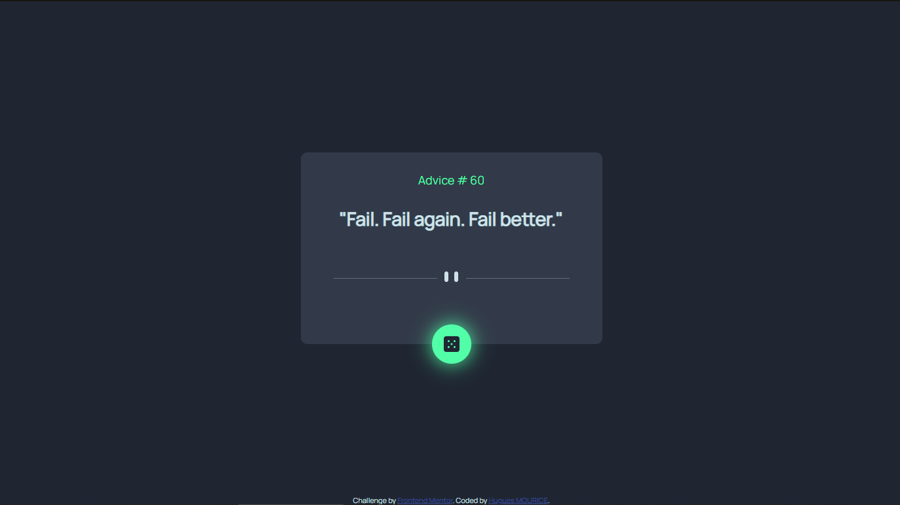

# Frontend Mentor - Advice generator app solution

This is a solution to the [Advice generator app challenge on Frontend Mentor](https://www.frontendmentor.io/challenges/advice-generator-app-QdUG-13db). Frontend Mentor challenges help you improve your coding skills by building realistic projects.

## Table of contents

- [Overview](#overview)
  - [The challenge](#the-challenge)
  - [Screenshot](#screenshot)
  - [Links](#links)
- [My process](#my-process)
  - [Built with](#built-with)
  - [What I learned](#what-i-learned)
  - [Continued development](#continued-development)
  - [Useful resources](#useful-resources)
- [Author](#author)
- [Acknowledgments](#acknowledgments)

## Overview

### The challenge

Users should be able to: 
- View the optimal layout for the app depending on their device's screen size
- See hover states for all interactive elements on the page
- Generate a new piece of advice by clicking the dice icon

### Screenshot

### Links

- Solution URL: [Add solution URL here](https://github.com/Mherlin06/P2-Advice_Generator_App)
- Live Site URL: [Add live site URL here](https://adorable-babka-e1915f.netlify.app)

## My process

### Built with

- Semantic HTML5 markup
- CSS custom properties
- Flexbox
- Javascript & Json (api)

### What I learned

For this project, i had to learn more about positioning, specially relative position.
i'm also quite happy about that :hover, easy to apply with a lot of potential.
Obviously, i learned how to use API ( CRUD, JSON, ...). it was more difficult to understand arrow function dealing with promises && .then.
I found myself stuck for a while, my code didn't seem to work at first. I figured out that i had to place my function after my HTML section to let the browser load the page entirely before accessing and calling the API.

### Continued development

I surely need to work again with APIs and arrow functions. Also use more :hover property with my css. that's a lot of fun.
My css is far from optimal and needs to be apply with Sass maybe.

### Useful resources

to learn and apply API calls i used some of the ressources down below:

- [OpenClassrooms (french courses)](https://openclassrooms.com/fr/courses/6573181-adoptez-les-api-rest-pour-vos-projets-web) - This helped me for API section. This course is well organized et quite easy to understand.
- [Mike Codeur](https://formations.mikecodeur.com/view/courses/api-pro/69245-appel-des-api-restful/197955-module-9-crud-api-en-javascript) - This guy is far from academic, but displays such great advices && allows us to pratice along him with concrete examples.
- [Useful tools](https://kigiri.github.io/fetch/)(https://curlconverter.com) - to anyone who read this, be free to take a look at those websites. Can be very useful when you work with curl commands

## Author

- Website - [hugues mourice](https://linkedin.com/in/hugues-mourice)
- Frontend Mentor - [Mherlin06](https://www.frontendmentor.io/profile/Mherlin06)

## Acknowledgments

She probably didn't know and sureley never will, but thank you https://github.com/han0224, your solution inspired me and help me get through
this solution .